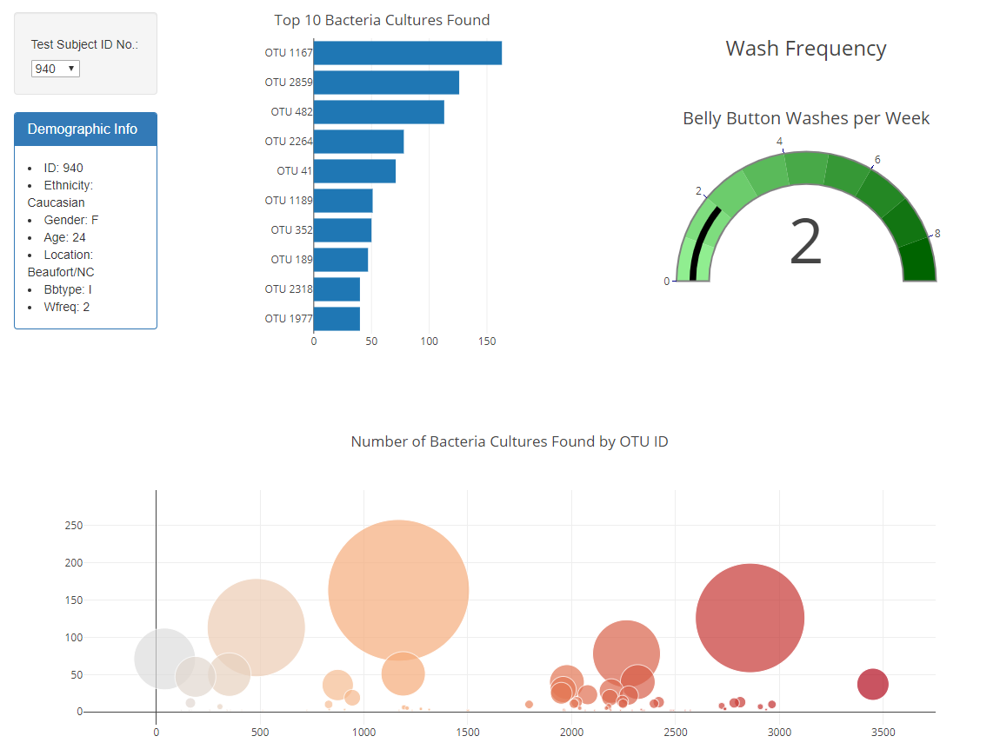

# Belly Button Biomes
This visualization explore microbes inhabiting human navels. [Data](http://robdunnlab.com/projects/belly-button-biodiversity/ "Laboratory website") is from the Rob Dunn lab.

##### [See the visualization here!](https://barrytik.github.io/Belly-Button-Biomes/)

Data includes demographic information, belly button wash frequency and types of bacteria found. Microbes are reffered to by their Operational Taxonomic Unit (OTU) number. 
All charts are made using [Plotly.js](https://plot.ly/javascript/ "Plotly website").

Update all graphics on the dashboard by selecting a test subject ID number from the dropdown. 

